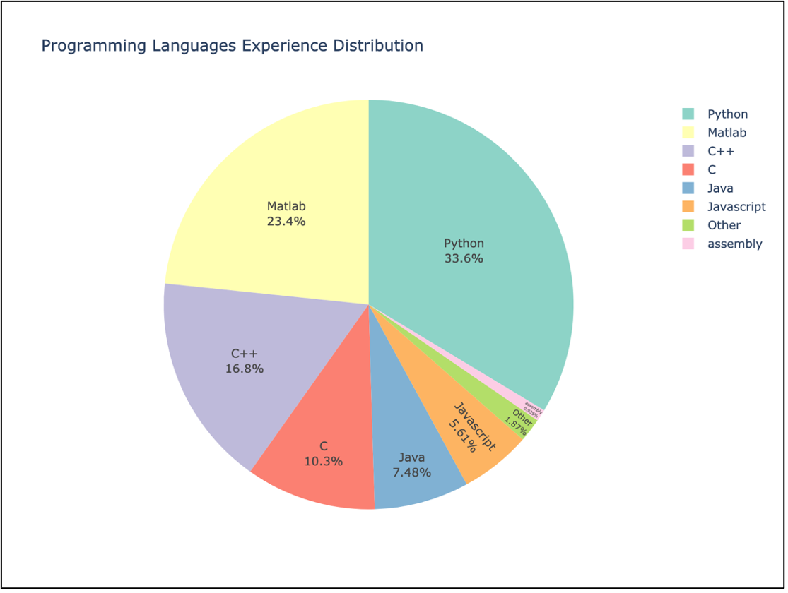
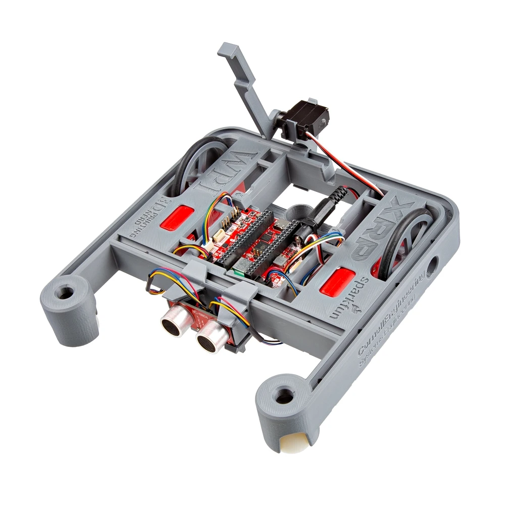
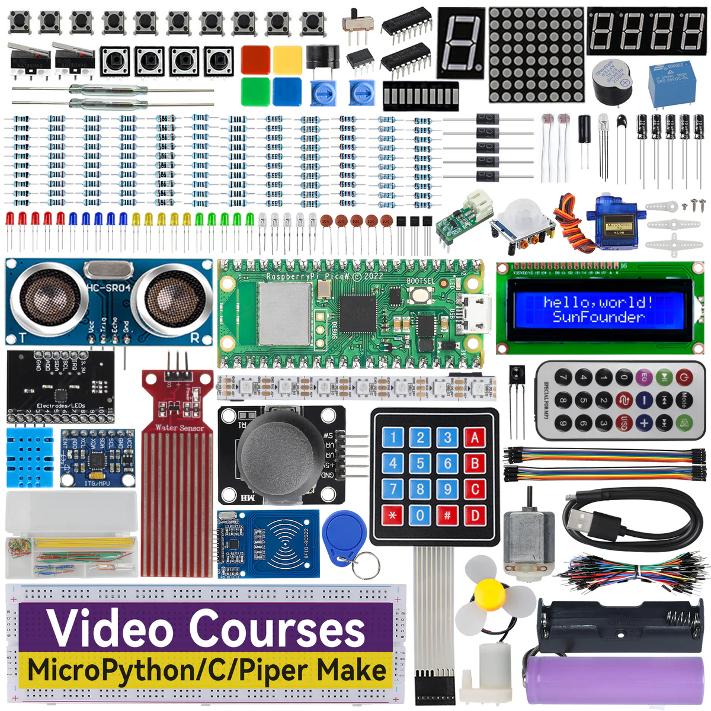
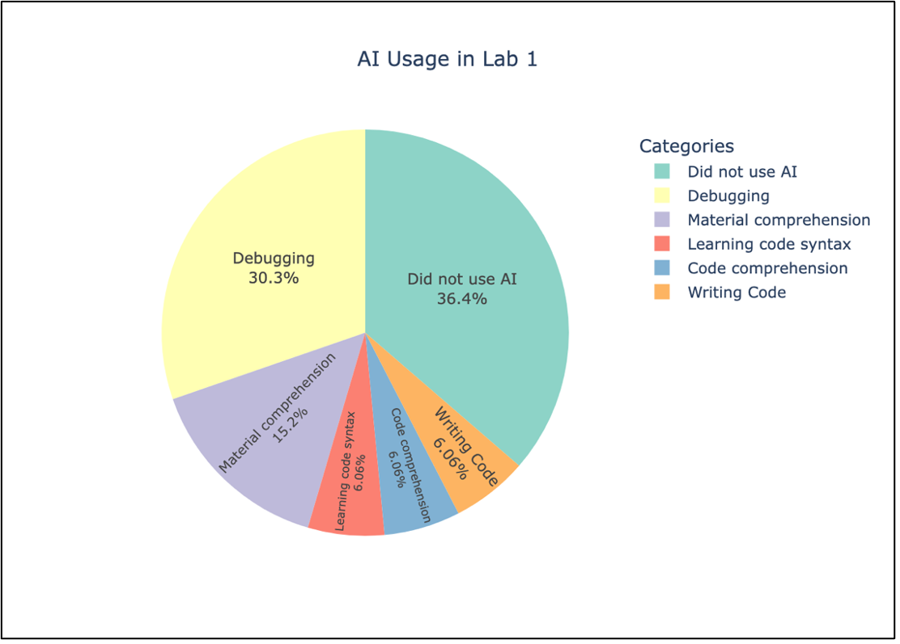
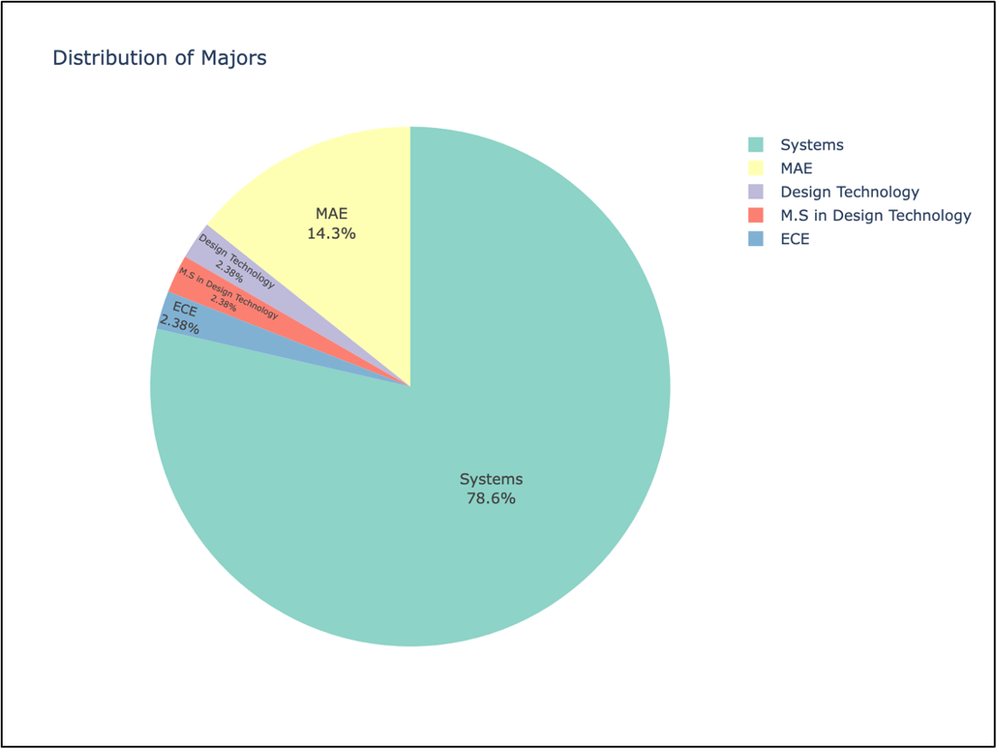
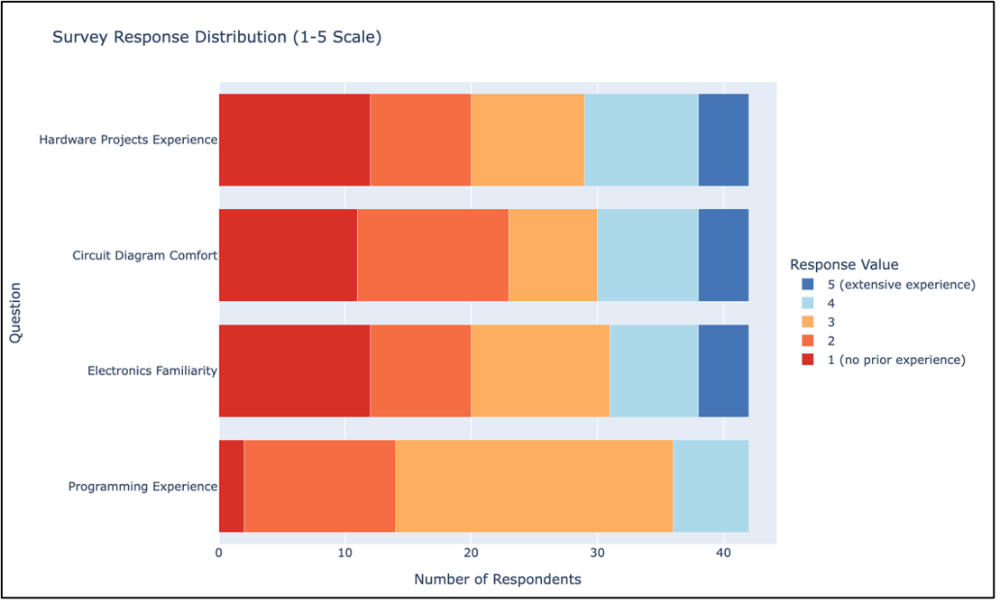

# Strategies for Hybrid, Hands-on Courses

### Robotics, Embedded Systems & IoT

A Work-in-Progress case study from <strong>Cornell Systems Engineering</strong>

ASEE Annual Conference · Work-in-Progress Session

<!--
~15 sec. Frame this clearly as a Work-in-Progress: we document implementation and early
observations, NOT proven efficacy. Set expectations now so the audience reads the rest
as a case study, not a controlled result.
-->

---
glowSeed: 100
---

# The Problem

Distance education is no longer an exception — it's structural.

📈
Enrollment shift

18% → 45%

Students enrolled <strong>exclusively online</strong> jumped between 2019 and 2020 (NSB 2024)

🏗️
Structural Changes

The shift is <strong>structural</strong>, not just pandemic related. Working professionals want <strong>part-time, employer-funded</strong> degrees.

🔧
The catch

Hardware-intensive labs are the <em>hardest</em> thing to deliver remotely — they depend on <strong>direct physical manipulation</strong> and <strong>sensory feedback</strong>

<!--
~1 min. This is the "why care" slide. The doubling of online enrollment is the hook.
Emphasize that this is a lasting structural shift, so the lab-delivery problem isn't
going away when the pandemic recedes.
-->

---
glowSeed: 175
---

# Why Existing Solutions Fall Short

🖥️
Simulations & remote-access labs

Keep students at arm's length — a <strong>"black-box" effect</strong> that breaks the link to real cyber-physical behavior.

📦
Take-home kits

Preserve physical debugging, but introduce new costs: lost <strong>peer coordination</strong>, weaker <strong>oral communication</strong>, harder <strong>integrity verification</strong>.

🤖
Generative AI

Can produce working <strong>code and lab reports</strong> with <strong>no conceptual understanding</strong> — a new threat to authentic learning.

This motivates our two interventions: <strong>standardized at-home kits</strong> + <strong>oral exams</strong>.

<!--
~1 min. Walk the three columns left to right. The punchline is the AI "new wrinkle,"
which sets up oral exams as the assessment response later in the talk.
-->

---
glowSeed: 123
---

# Research Questions

These emerged from <em>building</em> the courses — the paper lays groundwork rather than answering them definitively.

<v-clicks>

1

Do standardized <strong>"at-home" kits</strong> achieve technical and pedagogical <strong>parity</strong> between local and remote students?

2

Do <strong>periodic oral assessments</strong> support engagement and integrity in the age of generative AI?

3

Does the <strong>flipped format</strong> create a perceived increase in parity between on-campus and distance learners?

</v-clicks>

<!--
~45 sec. Read them quickly. Reiterate: this is exploratory groundwork for a longitudinal
study, not a claim of proven efficacy.
-->

---
layout: two-cols
layoutClass: gap-8
glowSeed: 180
---

# The Two Courses

<v-clicks>

- **SYSEN 5411** — Introduction to Robotics
- **SYSEN 5412** — Creating Solutions with Embedded Systems

Both are **one-credit, hybrid, flipped** modules.

Distance learners receive **identical lab kits** — microcontrollers, motors, servos, robot chassis, breadboard components.

</v-clicks>

::right::

The cohort: 44 students

27

On-campus full-time M.Eng.

17

Distance learners working professionals

This <strong>on-campus vs. distance</strong> contrast is the thread that pays off in the results.

<!--
~1 min. Plant the OC vs DL contrast deliberately — it's the setup for the engagement
surprise later. DL students are largely working professionals doing the M.Eng. part-time.
-->

---
glowSeed: 350
---

# Design Decision 1 — Flipped + Hybrid

How it works

- **Lectures:** asynchronous, pre-recorded video
- **Weekly synchronous sessions:** reserved for **demos and troubleshooting**
- Sessions **recorded** for remote students
- **Ed Discussion** for peer support, incentivized with participation points

Key insight

Pre-recording lectures **freed synchronous time** for the high-value, hands-on work that students said mattered most.

Flipped format received <strong>universally positive feedback</strong> in midterm and final evaluations.

<!--
~1 min. The mechanism that makes hybrid work: moving lecture out of synchronous time
lets the limited live hours go entirely to hands-on demonstration and debugging — the
thing remote students otherwise miss most.
-->

---
glowSeed: 12129
---

# Design Decision 2 — Hardware + Language

Language familiarity

Figure 2 — many students knew more than one language.

43%

were hardware novices who had never programmed a microcontroller

93%

already knew Python — the key justification for MicroPython

<!--
~1 min. The chart and the two stats tell the student-profile story before diving into the
hardware/language rationale on the next slide.
-->

---
glowSeed: 12130
---

# Design Decision 2 — Hardware + Language

Two linked choices, both driven by **parity**.

Hardware — tool-less kits

No soldering iron, no oscilloscope; strong online docs.

- 🤖 **XRP** (Experiential Robotics Platform) — web-based IDE
- 🔌 **SunFounder Pico** kit — MicroPython examples
- 🐍 **MicroPython** selected as the common language

<!--
~1 min. The 93% Python number justifies MicroPython: reduce the syntax and tooling
hurdle so cognitive load goes to sensor integration and control loops, not memory
management or compilation.
-->

---
glowSeed: 182
---

# Assessment — Oral Exams + Workload

The oral exam

A **20-minute Zoom design review** after the planning phase of the final project. Three inquiries:

- **User interaction** — the envisioned UI/UX
- **System mapping** — use cases → requirements → state machine
- **Implementation strategy** — *why* polling vs. interrupts, *why* this sensor

Both an <strong>AI-mitigation tool</strong> and a <strong>relational touchpoint</strong>.

Feedback regarding workload

🔋 <strong>Hardware debugging challenges</strong> 
Students lost up to <strong>3+ hours</strong> debugging problems what ended up being simple problems (eg. dead AA batteries).

The **"two-hour rule"**: if a hardware issue persists, go to office hours.

 Extended hardware debugging led to making the robotics <strong>final project optional</strong> to stay within workload requirements.

<!--
~1.5 min. CORE SLIDE — give it room. Tell the battery brown-out story out loud; it's the
most quotable moment. Frame oral exams as the distinctive contribution: they test the
"why" that AI can't fake. Scalable via TAs; can compress to ~10 min (7 present + 3 Q&A).
-->

---
layout: center
class: text-center
glowSeed: 205
---

# Early Result — DL Engagement 

Contrary to expectations, distance learners were <em>more</em> engaged than on-campus students.

📦
Distance learners

Treated the project as a creative <strong>"break"</strong> from professional duties — more ambitious and creative in their final projects.

🎓
On-campus students

Under heavy full-time loads, defaulted to <strong>minimum viable products</strong>.

Oral exams reliably surfaced students who'd skipped foundational labs — 
<strong>near-perfect correlation</strong> between incomplete weekly work and weak design reviews.

<!--
~1.5 min. CORE SLIDE and the headline finding. This reframes the "distance-learner-as-
disadvantaged" assumption. Land it clearly. The correlation between missed labs and weak
oral performance is the evidence that oral exams reveal real gaps.
-->

---
layout: two-cols
layoutClass: gap-8
glowSeed: 125
---

# Early Result — AI Usage

From **Lab 1** self-reports:

Figure 4 — some students reported more than one use.

::right::

Interpretation

Students used AI to get past **friction points** — *not* to replace learning.

Conceptual and code-<em>writing</em> uses were <strong>rare</strong>; debugging dominated active use.

This strengthens the case for <strong>oral exams</strong>: let AI handle the <strong>"how,"</strong> while assessment tests the <strong>"why."</strong>

<!--
~1 min. The takeaway is the framing, not the exact percentages: AI as friction-reducer,
not learning-replacer. This dovetails directly back to the oral-exam argument.
-->

---
glowSeed: 310
---

# Future Work

Signals the longitudinal study to come.

🤖

Develop <strong>boilerplate code</strong> for students to cut low-level debugging and shift focus to integration.

📋

<strong>Tiered oral-exam schedule</strong> — three 10 min oral checkpoints across the term, using predefined questions.

📊

<strong>Systematic friction logging</strong> — categorize hardware vs. software debugging.

🔍

Classify AI use as <strong>"augmentative" vs. "bypass,"</strong> correlated with oral performance.

✅

<strong>IRB approval</strong> for demographic analysis (gender, industry background).

🧑‍🏫

Test oral exams as an <strong>alternative to peer learning</strong> in asynchronous settings.

<!--
~1 min. Brisk. The thread tying these together: turning this case study into a formal,
IRB-approved longitudinal study with quantitative friction and AI-use data.
-->

---
layout: center
class: text-center
glowSeed: 150
---

# Conclusion

⚖️

Parity needs pedagogy

Identical hardware isn't enough — the framework around it is what creates parity.

📦

Tool-less kits cut friction

No soldering, no oscilloscope, strong docs → cognitive load goes to systems logic.

🗣️

Oral exams = mentorship

Turn assessment into authentic design review, resilient to AI shortcuts.

A foundation for a fuller, longitudinal study on hands-on engineering education for the modern working professional.

<!--
~45 sec. Three clean takeaways. Close by positioning the work as groundwork. Don't
oversell — it's a WIP.
-->

---
layout: center
class: text-center
glowSeed: 229
---

# Thank You

### Questions & Discussion

Cornell Systems Engineering · SYSEN 5411 & 5412

Backup slides follow: cohort majors · topic-familiarity ranking

<!--
Contact info goes here. Slides 8 (oral exams + brown-out) and 9 (engagement surprise)
are the core — if running long, compress slides 2 and 3, not these. Keep backup charts
ready for detailed questions.
-->

---
glowSeed: 100
---

# Backup — Cohort Majors

Figure 1 — Distribution of majors across SYSEN 5411 + 5412.

<!--
Backup only. Pull up on demand for detailed questions about cohort composition.
-->

---
glowSeed: 100
---

# Backup — Topic Familiarity

Figure 3 — Self-rated familiarity, 1–5 scale.

Questions asked:

- Experience with **hands-on hardware** projects (maker-space, labs)
- Comfort **reading circuit / wiring diagrams**
- Familiarity with **basic electronics** (resistors, LEDs, breadboards)
- Prior **programming experience**

<!--
Backup only. Pull up on demand for detailed questions about incoming skill level.
-->
